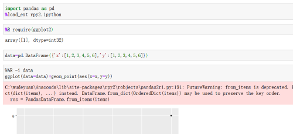
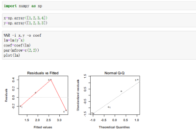

# 配置
1. 安装*R*
>a. 可以去网上搜索安装包直接安装。将*R*的路径放到系统环境，就可以在*cmd*中输入*R*来检验*R*安装是否成功。  
>b. 系统环境例：*Path*中添加<kbd>C:\wudeyuan\R-3.6.2\bin\x64</kbd>
2. *python*识别*R*
> a. *cmd*中<kbd>conda install rpy2</kbd>  
> b. 配置两个路径: *R_HOME*（<kbd>C:\wudeyuan\R-3.6.2</kbd>）；*R_USER*（<kbd>C:\wudeyuan\Anaconda\Lib\site-packages\rpy2</kbd>）  
> c. 建议设置好以后重启一下
# python调用*R*
```python
from rpy2.robjects import r as Rcode
from rpy2.robjects.packages import importr as Rrequire
Rrequire('ggplot2') # 导入R包
print(Rcode("pi")) # 运行R语句
# [1] 3.141593
```
# 在notebook中应用
1. anoconda环境下启动notebook  
 
2. 上图实现的过程中需要注意以下几点：
> a. -i表示input，有时候还会用到-o，表示output    
> b. 注意在这里R中的library用不了，用require  
> c. 直接运行load_ext rpy2.ipython大概率会因为缺少一些包出错，**缺什么补什么**  
> d. %%R指的是调用%R，直接%R调用不了ggplot2
3. 以下再给出一个调用R的例子，注意这里调用的%R调用的是R的基础包  
  

# 附
1. notebook中的语法提示(不太有用，直接用pycharm/vs code更好)，cmd中安装nbextensions，代码如下：
```cmd
pip install jupyter_contrib_nbextensions
jupyter contrib nbextension install --user
pip install --user jupyter_nbextensions_configurator
jupyter nbextensions_configurator enable --user
:: 重启notebook后在nbextensions中勾选Hinterland
```
2. R运行python可参考R的包reticulate
